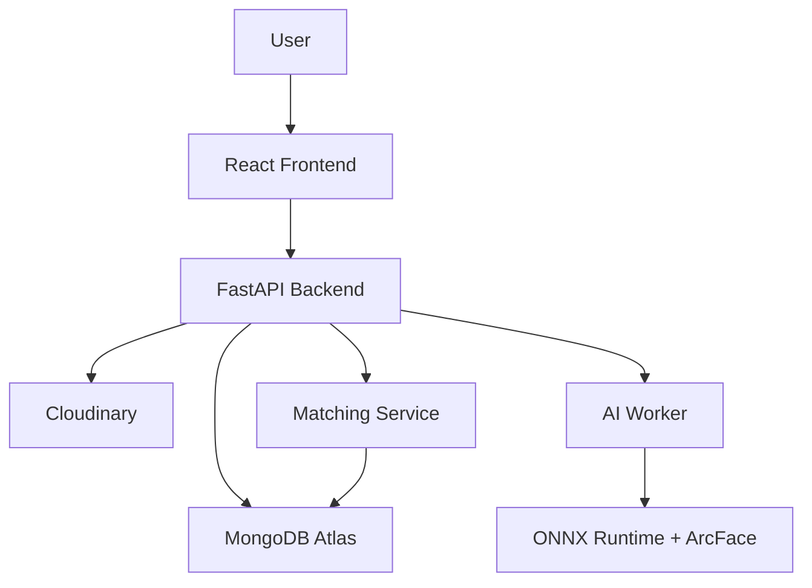

# Guardian-Link

**AI-Powered Lost & Found Child Detection System**

A full-stack application for reporting missing and found children, featuring AI-powered face matching using ONNX Runtime with ArcFace embeddings, admin verification, and public alert sharing.

---

## Table of Contents

- [Project Overview](#project-overview)
- [Key Features](#key-features)
- [System Architecture](#system-architecture)
- [AI Matching Pipeline](#ai-matching-pipeline)
- [Technology Stack](#technology-stack)
- [Project Structure](#project-structure)
- [Getting Started](#getting-started)
- [Environment Variables](#environment-variables)
- [API Overview](#api-overview)
- [Authentication](#authentication)
- [Database Design](#database-design)
- [Running the AI Worker](#running-the-ai-worker)
- [Face Matching](#face-matching)
- [Production Architecture](#production-architecture)
- [Security Considerations](#security-considerations)
- [Limitations](#limitations)
- [Development Notes](#development-notes)
- [Future Improvements](#future-improvements)
- [Contributing](#contributing)
- [License](#license)

---

## Project Overview

Guardian-Link is a lost and found child identification system that leverages artificial intelligence to match missing child reports with found child reports. The system enables users to submit reports with photographs, automatically processes these reports through an AI pipeline to generate face embeddings using ONNX Runtime with ArcFace, and identifies potential matches based on facial similarity. Metadata differences (age, gender, location, user_id) are logged as warnings rather than blocking matches to avoid missing potential matches.

## Key Features

### Report Management
- Report missing children with detailed information (name, age, gender, location, photo)
- Report found children with similar details
- Image upload with validation, compression, and Cloudinary storage
- Structured location data (country, state, district, city, coordinates)
- Report status tracking (Pending, Processing, Ai Matches, Resolved)

### AI-Powered Face Matching
- Automatic face embedding generation using ONNX Runtime with ArcFace model
- 512-dimensional face embeddings stored in MongoDB
- Cosine similarity-based matching
- Metadata warnings (age, gender, location, user_id) logged but do not block matching
- Cross-user matching enforcement (prevents self-matches)
- Duplicate match prevention
- Confidence scoring (High ≥75%, Medium 50-74%, Low <50%)
- Top-5 ranked matches per report

### Background Job Processing
- Persistent AI job queue in MongoDB
- Embedded worker within FastAPI process
- Atomic job claiming with retry logic
- Automatic reclamation of stuck jobs
- Thread-safe ONNX model initialization with caching
- CPU thread limiting for resource-constrained environments

### Authentication & Authorization
- User registration with email and mobile verification
- JWT-based authentication with access tokens (30 minutes) and refresh tokens (7 days)
- Google OAuth integration for social login
- Password reset via email
- Role-based access control (User, Admin)
- Profile completion requirement before accessing main features

### Admin Panel
- Dashboard statistics (users, reports, matches)
- User management (view, delete)
- Report management (view, delete, resolve)
- Match verification (confirm/reject)
- Audit log trail

### Public Feed
- Public-facing missing children feed
- State-wise statistics for intelligence map
- Emergency contact information

### Notifications
- In-app notifications with polling
- Email notifications (optional SMTP)
- User notification preferences
- Match alert notifications

## System Architecture



### Architecture Flow

1. **Frontend (React + Vite)**: User interface for reporting, viewing matches, and admin operations
2. **Backend (FastAPI)**: RESTful API, authentication, report processing, matching logic
3. **Database (MongoDB Atlas)**: Persistent storage for users, reports, embeddings, matches, jobs
4. **Image Storage (Cloudinary)**: Cloud-based image hosting with compression
5. **AI Worker**: Background task processing for face embedding generation and matching
6. **Face Recognition (ONNX Runtime + ArcFace)**: Face embedding generation using pre-trained ONNX model
7. **Matching Service**: Candidate filtering, similarity calculation, match ranking

## AI Matching Pipeline

### Complete Workflow

1. **Report Submission**
   - User submits missing or found report with photo
   - Image validated, compressed, and uploaded to Cloudinary
   - Report document created in MongoDB (`children` or `children_found` collection)
   - AI job created in `ai_jobs` collection with status "queued"

2. **AI Job Processing**
   - Background worker polls `ai_jobs` collection every 5 seconds
   - Worker atomically claims job (status changes to "processing")
   - Report status updated to "processing"
   - Image downloaded from Cloudinary with retry logic (max 3 attempts)

3. **Embedding Generation**
   - Image preprocessed (BGR to RGB, resized to 112x112, normalized to [-1, 1])
   - ONNX Runtime ArcFace model generates 512-dimensional face embedding
   - Embedding L2-normalized
   - Embedding stored in `face_embeddings` collection with model version tracking
   - Report updated with embedding status and model information
   - Job marked as success

4. **Candidate Search**
   - System queries opposite collection (missing → found, found → missing)
   - Candidates filtered by status (active reports only)
   - Same-user and same-report matches rejected
   - Only reports with successful embeddings considered

5. **Similarity Calculation**
   - Cosine similarity computed between source and candidate embeddings
   - Raw score compared against `MATCH_THRESHOLD` (default: 50.0)
   - Candidates below threshold discarded

6. **Metadata Handling**
   - Gender, age, location, and user_id differences logged as warnings
   - Metadata does NOT block match creation (to avoid missing potential matches)
   - Warnings stored in match document for review

7. **Match Creation**
   - Duplicate check performed (existing match between same pair)
   - Match document created in `matches` collection with metadata warnings
   - Missing child status updated to "Ai Matches"
   - Audit log entry created

8. **Notification**
   - In-app notification created for both users
   - Match visible in Matches page for both users

9. **Admin Verification**
   - Admin reviews matches in admin panel
   - Match confirmed or rejected
   - Status updated to "Confirmed" or "Rejected"
   - If confirmed, missing child status updated to "Resolved"

## Technology Stack

### Frontend
- **Framework**: React 18.2.0
- **Build Tool**: Vite 5.0.0
- **Styling**: Tailwind CSS 3.3.5
- **Routing**: React Router DOM 6.20.0
- **Icons**: Lucide React 0.292.0
- **Animations**: Framer Motion 12.42.2
- **Maps**: React Simple Maps 3.0.0
- **Testing**: Vitest 1.0.0
- **Linting**: ESLint 8.53.0

### Backend
- **Framework**: FastAPI 0.104.1
- **Runtime**: Python 3.11
- **ASGI Server**: Uvicorn 0.24.0
- **Database Driver**: Motor 3.3.2 (async MongoDB)
- **Authentication**: python-jose 3.3.0 (JWT), passlib 1.7.4 (bcrypt)
- **Validation**: Pydantic 2.5.3
- **HTTP Client**: httpx 0.25.2, aiohttp 3.9.1

### Database
- **Database**: MongoDB Atlas
- **Driver**: Motor (async Python driver)
- **Collections**: users, children, children_found, face_embeddings, matches, ai_jobs, audit_logs, user_notifications, notifications, refresh_tokens, password_reset_tokens, email_verification_tokens

### AI / Machine Learning
- **Face Recognition**: ONNX Runtime 1.17.1 with ArcFace model
- **Face Detection**: Pre-cropped face input (assumes face already detected)
- **Recognition Model**: ArcFace (512-dimensional embeddings)
- **Image Processing**: OpenCV 4.8.1.78, Pillow 10.1.0, NumPy 1.26.2

### Cloud Services
- **Image Storage**: Cloudinary 1.36.0
- **Database**: MongoDB Atlas

### Deployment
- **Containerization**: Docker
- **Orchestration**: Docker Compose
- **Frontend Server**: Nginx (Alpine)
- **Backend Server**: Uvicorn
- **Process Management**: Embedded asyncio worker

### Development Tools
- **Package Manager**: npm (frontend), pip (backend)
- **Version Control**: Git
- **Environment**: python-dotenv 1.0.0

## Project Structure

```
LOST-FOUND-SYSTEM/
├── backend/
│   ├── app/
│   │   ├── routes/              # API endpoint definitions
│   │   ├── services/            # Business logic (embedding, matching, job queue)
│   │   ├── models/               # Pydantic models
│   │   ├── database/             # MongoDB connection and indexes
│   │   ├── utils/                # Utility functions
│   │   ├── dependencies/         # FastAPI dependencies
│   │   ├── main.py               # FastAPI application entry point
│   │   ├── config.py             # Configuration management
│   │   └── worker.py             # AI background worker
│   ├── requirements.txt          # Python dependencies
│   └── Dockerfile               # Backend Docker configuration
├── frontend/
│   ├── src/
│   │   ├── pages/                # React page components
│   │   ├── components/           # Reusable components
│   │   ├── context/              # React context providers
│   │   ├── services/             # API service layer
│   │   └── main.jsx              # Application entry point
│   ├── package.json              # Node.js dependencies
│   ├── vite.config.js            # Vite configuration
│   └── Dockerfile                # Frontend Docker configuration
├── docker-compose.yml            # Docker Compose configuration
└── README.md                     # This file
```

## Getting Started

### Prerequisites

- **Node.js**: 18.x or higher
- **Python**: 3.11 or higher
- **MongoDB**: MongoDB Atlas account (free tier sufficient)
- **Cloudinary**: Cloudinary account (free tier sufficient)
- **ArcFace ONNX Model**: Must be downloaded to `backend/models/arcface.onnx`

### Backend Setup

1. **Clone the repository**
   ```bash
   git clone <repository-url>
   cd LOST-FOUND-SYSTEM
   ```

2. **Create virtual environment**
   ```bash
   cd backend
   python -m venv venv
   
   # Windows
   venv\Scripts\activate
   
   # macOS/Linux
   source venv/bin/activate
   ```

3. **Install dependencies**
   ```bash
   pip install -r requirements.txt
   ```

4. **Download ArcFace ONNX model**
   ```bash
   # Run the model download script
   python backend/models/download_model.py
   ```

5. **Configure environment variables**
   ```bash
   # Create .env file project root
   # Set required variables:
   # - MONGO_URI (MongoDB Atlas connection string)
   # - SECRET_KEY (JWT signing secret, 32+ characters)
   # - CLOUDINARY_CLOUD_NAME, CLOUDINARY_API_KEY, CLOUDINARY_API_SECRET
   ```

6. **Start backend server**
   ```bash
   cd backend
   python -m uvicorn app.main:app --reload --host 0.0.0.0 --port 8000
   ```
   
   Backend will be available at `http://127.0.0.1:8000`
   API documentation at `http://127.0.0.1:8000/docs`

### Frontend Setup

1. **Install dependencies**
   ```bash
   cd frontend
   npm install
   ```

2. **Start development server**
   ```bash
   npm run dev
   ```
   
   Frontend will be available at `http://localhost:5173`

## Environment Variables

### Required Variables

- `MONGO_URI` — MongoDB Atlas connection string
- `SECRET_KEY` — JWT signing secret (minimum 32 characters)

### Optional Variables

#### Database
- `DB_NAME` — Database name (default: `guardian_link`)

#### Authentication
- `ACCESS_TOKEN_EXPIRE_MINUTES` — Access token lifetime in minutes (default: 30)
- `REFRESH_TOKEN_EXPIRE_DAYS` — Refresh token lifetime in days (default: 7)
- `PASSWORD_RESET_EXPIRE_MINUTES` — Password reset link validity (default: 30)
- `EMAIL_VERIFY_EXPIRE_HOURS` — Email verification link validity (default: 24)

#### CORS
- `CORS_ORIGINS` — Comma-separated list of allowed origins (default: `http://localhost:5173,http://127.0.0.1:5173`)

#### File Uploads
- `MAX_UPLOAD_SIZE_MB` — Maximum upload size in MB (default: 10)

#### Cloudinary
- `CLOUDINARY_CLOUD_NAME` — Cloudinary cloud name
- `CLOUDINARY_API_KEY` — Cloudinary API key
- `CLOUDINARY_API_SECRET` — Cloudinary API secret

#### Email (SMTP)
- `SMTP_HOST` — SMTP server host
- `SMTP_PORT` — SMTP server port (default: 587)
- `SMTP_USER` — SMTP username
- `SMTP_PASSWORD` — SMTP password
- `SMTP_FROM` — From email address

#### AI Model
- `FACE_MODEL_NAME` — Face recognition model (default: ArcFace)
- `MATCH_THRESHOLD` — Similarity threshold for matches (default: 50.0)
- `TOP_MATCH_LIMIT` — Maximum matches per report (default: 5)
- `AGE_TOLERANCE` — Age difference tolerance in years (default: 2)
- `LOCATION_RADIUS` — Location matching radius in km (default: 25.0)
- `HIGH_MATCH_THRESHOLD` — High confidence threshold (default: 75.0)
- `MEDIUM_MATCH_THRESHOLD` — Medium confidence threshold (default: 50.0)
- `LOW_MATCH_THRESHOLD` — Low confidence threshold (default: 0.0)

#### Default Admin
- `DEFAULT_ADMIN_EMAIL` — Default admin email (default: admin@guardianlink.com)
- `DEFAULT_ADMIN_PASSWORD` — Default admin password (default: 1234)
- `DEFAULT_ADMIN_NAME` — Default admin name (default: System Admin)

#### Google OAuth
- `GOOGLE_CLIENT_ID` — Google OAuth client ID
- `GOOGLE_CLIENT_SECRET` — Google OAuth client secret

#### SMS Provider
- `SMS_PROVIDER` — SMS provider (options: twilio, mock; default: mock)
- `SMS_API_KEY` — SMS API key
- `SMS_SENDER_ID` — SMS sender ID

## API Overview

### Authentication Endpoints

| Method | Endpoint | Description | Auth Required |
|--------|----------|-------------|---------------|
| POST | `/api/auth/register` | Register new user | No |
| POST | `/api/auth/login` | User login | No |
| POST | `/api/auth/refresh` | Refresh access token | No |
| POST | `/api/auth/logout` | User logout | No |
| POST | `/api/auth/forgot-password` | Request password reset | No |
| POST | `/api/auth/reset-password` | Reset password with token | No |
| POST | `/api/auth/verify-email` | Verify email address | No |
| POST | `/api/auth/google` | Google OAuth authentication | No |
| POST | `/api/auth/send-otp` | Send OTP for mobile verification | No |
| POST | `/api/auth/verify-otp` | Verify OTP code | No |
| GET | `/api/auth/me` | Get current user info | Yes |

### User Endpoints

| Method | Endpoint | Description | Auth Required |
|--------|----------|-------------|---------------|
| GET | `/api/user/profile` | Get user profile | Yes |
| PUT | `/api/user/profile` | Update user profile | Yes |
| PUT | `/api/user/change-password` | Change password | Yes |
| DELETE | `/api/user/account` | Delete user account | Yes |

### Report Endpoints

| Method | Endpoint | Description | Auth Required |
|--------|----------|-------------|---------------|
| POST | `/api/children/report-lost` | Report missing child | Yes |
| POST | `/api/children/report-found` | Report found child | Yes |
| GET | `/api/children/missing` | Get missing children reports | Yes |
| GET | `/api/children/found` | Get found children reports | Yes |

### Match Endpoints

| Method | Endpoint | Description | Auth Required |
|--------|----------|-------------|---------------|
| GET | `/api/matches/` | Get all matches for current user | Yes |
| GET | `/api/matches/{match_id}` | Get specific match details | Yes |
| POST | `/api/matches/{match_id}/confirm` | Confirm a match | Yes (Admin) |
| POST | `/api/matches/{match_id}/reject` | Reject a match | Yes (Admin) |

### Admin Endpoints

| Method | Endpoint | Description | Auth Required |
|--------|----------|-------------|---------------|
| GET | `/api/admin/dashboard` | Get dashboard statistics | Yes (Admin) |
| GET | `/api/admin/all-users` | Get all users | Yes (Admin) |
| DELETE | `/api/admin/users/{user_id}` | Delete user | Yes (Admin) |

### Public Endpoints

| Method | Endpoint | Description | Auth Required |
|--------|----------|-------------|---------------|
| GET | `/api/public/feed` | Get public missing children feed | No |
| GET | `/api/public/stats` | Get public statistics | No |
| GET | `/api/public/report/{report_id}` | Get public report details | No |

Full interactive API documentation available at `/docs` when backend is running.

## Authentication

The system uses JWT (JSON Web Tokens) for authentication with the following flow:

1. **Registration**: User registers with email, mobile, and password
2. **Email Verification**: Verification email sent (optional SMTP)
3. **Mobile Verification**: OTP sent via SMS (optional Twilio)
4. **Profile Completion**: User completes profile before accessing main features
5. **Login**: User receives access token (30 min) and refresh token (7 days)
6. **Token Refresh**: Access token refreshed using refresh token
7. **Logout**: Tokens invalidated on server

### Token Types

- **Access Token**: Short-lived (30 minutes), used for API requests
- **Refresh Token**: Long-lived (7 days), used to obtain new access tokens

### Google OAuth

Users can authenticate using Google OAuth:
- Google Identity Services integration
- Automatic profile completion for new users
- Seamless login for existing users

## Database Design

### MongoDB Collections

#### users
- User accounts and authentication data
- Fields: email, password (hashed), full_name, mobile, gender, address, role, email_verified, mobile_verified, profile_complete, preferences, created_at

#### children
- Missing child reports
- Fields: child_name, age, gender, location_structured, date_missing, description, image_url, public_id, reporter_email, user_id, ai_processing_status, embedding_status, status, created_at

#### children_found
- Found child reports
- Fields: same as children collection

#### face_embeddings
- Face embedding vectors
- Fields: report_id, embedding (512-dimensional float array), embedding_model_version, embedding_dimensions, status, created_at

#### matches
- Match records between missing and found reports
- Fields: missing_id, found_id, missing_reporter, found_reporter, rank, confidence, similarity, raw_score, score, status, metadata_warnings, created_at

#### ai_jobs
- AI processing job queue
- Fields: report_id, report_type, report_collection, status, attempts, max_attempts, created_at, started_at, completed_at, last_error, next_retry_at

#### audit_logs
- System audit trail
- Fields: action, actor_email, target_type, target_id, details, created_at

#### user_notifications
- User-specific notifications
- Fields: recipient_email, type, title, message, read, created_at

#### notifications
- System-wide notifications
- Fields: type, message, child_name, child_age, child_location, reporter_email, created_at

#### refresh_tokens
- JWT refresh tokens
- Fields: email, token_hash, expires_at, created_at

#### password_reset_tokens
- Password reset tokens
- Fields: email, token_hash, expires_at, created_at

#### email_verification_tokens
- Email verification tokens
- Fields: email, token_hash, expires_at, created_at

### Database Indexes

Indexes are automatically created on startup for:
- users: email (unique)
- children: reporter_email, status, embedding_status, created_at
- children_found: reporter_email, status, embedding_status, created_at
- face_embeddings: report_id (unique), status, embedding_dimensions
- matches: status, created_at, missing_reporter, found_reporter
- ai_jobs: status, next_retry_at, created_at
- user_notifications: recipient_email, read, created_at
- notifications: created_at
- refresh_tokens: token_hash, email, expires_at
- password_reset_tokens: token_hash, expires_at
- email_verification_tokens: token_hash, expires_at

## Running the AI Worker

The AI worker runs automatically as an embedded background task within the FastAPI process:

- **Startup**: Worker starts during FastAPI lifespan
- **Polling**: Polls `ai_jobs` collection every 5 seconds
- **Claiming**: Atomically claims jobs using MongoDB find_one_and_update
- **Processing**: Processes jobs sequentially (one at a time)
- **Shutdown**: Gracefully cancelled on FastAPI shutdown

### Job Lifecycle

1. **Created**: Job created with status "queued"
2. **Claimed**: Worker claims job, status changes to "processing"
3. **Processing**: Worker downloads image, generates embedding
4. **Success**: Job marked as success, report updated
5. **Failure**: Job marked as failure, error logged
6. **Retry**: Failed jobs requeued with exponential backoff
7. **Reclamation**: Jobs stuck in "processing" > 5 minutes reclaimed

### Thread-Safe Model Initialization

- **Lock Protection**: threading.Lock() prevents concurrent initialization
- **Double-Check Locking**: Efficient lock usage with double-check pattern
- **Model Caching**: Initialized ONNX session cached globally for reuse
- **Error Caching**: Initialization failures cached to prevent retry loops

### Production Behavior

- **Automatic Reconnection**: MongoDB reconnection on connection errors
- **Stuck Job Reclamation**: Jobs stuck > 5 minutes automatically requeued
- **Retry Logic**: Failed jobs retry up to 5 times

## Face Matching

### Embedding Model
- **Model**: ArcFace (ONNX format)
- **Embedding Dimensions**: 512
- **Preprocessing**: BGR to RGB, resize to 112x112, normalize to [-1, 1]
- **Normalization**: L2 normalization applied to embeddings

### Similarity Calculation
- **Metric**: Cosine similarity
- **Formula**: `similarity = (A · B) / (||A|| × ||B||) × 100`
- **Output**: Percentage (0.0 to 100.0)

### Match Threshold
- **Default Threshold**: 50.0 (configurable via `MATCH_THRESHOLD`)
- **Confidence Levels**:
  - High: ≥75.0
  - Medium: 50.0-74.9
  - Low: <50.0

### Candidate Selection
- Candidates retrieved from opposite collection (missing → found, found → missing)
- Only reports with successful embeddings considered
- Same-user and same-report matches rejected
- Status filtering (active reports only)

### Metadata Handling
- Gender, age, location, and user_id differences logged as warnings
- Metadata does NOT block match creation
- Warnings stored in match document for admin review

### Ranking
- Matches ranked by final score (descending)
- Top N matches stored (default: 5, configurable via `TOP_MATCH_LIMIT`)

### Duplicate Prevention
- Database query checks for existing match between same missing/found pair
- Prevents duplicate match creation
- Supports bidirectional matching (missing_id/found_id and found_id/missing_id)

**Important:** The system generates potential matches based on facial embedding similarity. Match quality depends on image quality, lighting conditions, and angle. This is an assistive tool to help identify potential matches, not a guaranteed identification system.

## Production Architecture

The application is designed for deployment on cloud platforms:

- **Frontend**: Can be deployed to Vercel, Netlify, or any Docker-compatible hosting
- **Backend**: Can be deployed to Render, Railway, or any Docker-compatible hosting
- **Database**: MongoDB Atlas (cloud-hosted MongoDB)
- **Image Storage**: Cloudinary (cloud-based image hosting)

### Docker Deployment

The application supports Docker-based deployment using Docker Compose:

```bash
docker-compose up --build
```

## Security Considerations

### Implemented Protections

- **Authentication**: JWT-based authentication with access and refresh tokens
- **Authorization**: Role-based access control (User, Admin)
- **Password Security**: Bcrypt hashing for password storage
- **Input Validation**: Pydantic models for request validation
- **Image Validation**: MIME type and size validation for uploads
- **Environment Variables**: Sensitive configuration via environment variables
- **CORS**: Configurable CORS origins
- **SQL Injection Prevention**: MongoDB parameterized queries (not susceptible to SQL injection)

### Limitations

- The application is not fully hardened for production use
- No rate limiting implemented
- No request throttling
- No comprehensive security audit performed
- Email and SMS OTP are optional (may be disabled)

## Limitations

- **Face Matching Accuracy**: Match quality depends on image quality, lighting, angle, and facial expression. The system may produce false positives or false negatives.
- **Metadata Accuracy**: User-provided metadata (age, gender, location) may be inaccurate and is only used for warnings, not blocking matches.
- **Model Limitations**: The ArcFace model has inherent limitations in recognizing faces across different demographics, ages, and conditions.
- **Internet Dependency**: The system requires internet connectivity for Cloudinary image storage and MongoDB Atlas database access.
- **Processing Time**: Embedding generation and matching may take several seconds per report depending on server resources.
- **Scalability**: The embedded worker processes jobs sequentially, which may become a bottleneck at high volume.

## Development Notes

### Background Processing Architecture
- AI worker is embedded within FastAPI as an asyncio background task
- Jobs are stored in MongoDB for persistence across restarts
- Atomic job claiming prevents duplicate processing
- Stuck job reclamation handles worker failures

### Database Consistency
- Embeddings stored in separate collection from child documents
- Unique index on report_id prevents duplicate embeddings
- Match duplicate prevention via database query
- Audit logging for critical operations

### Match Duplicate Prevention
- Database query checks for existing match between same missing/found pair
- Supports bidirectional matching (missing_id/found_id and found_id/missing_id)
- Prevents duplicate match creation

### AI Processing Statuses
- `queued`: Job created, waiting for worker
- `processing`: Worker actively processing
- `success`: Embedding generated successfully
- `failed`: Embedding generation failed

## Future Improvements

**NOT CURRENTLY IMPLEMENTED**

Potential enhancements for future development:

- **Real-time Notifications**: WebSocket-based real-time match alerts
- **Advanced Monitoring**: Comprehensive logging and monitoring integration
- **Worker Scaling**: Separate worker process for better scalability
- **Vector Search**: Implement vector database for faster similarity search
- **Model Evaluation**: Automated evaluation of match quality
- **Retry Strategies**: Enhanced retry logic with exponential backoff
- **Admin Review Workflow**: Enhanced admin review tools for match verification
- **Multi-language Support**: Internationalization for multiple languages
- **Mobile Application**: React Native mobile app for on-the-go reporting

## Contributing

This is an academic project. Contributions are welcome but should align with the project's educational purpose.

## License

This is an academic final-year project. No specific license is currently applied.

For academic or educational use, please contact the project maintainers.

For issues, questions, or contributions, please refer to the project repository or contact the development team.

---

<div align="center">

**Built with ❤️ for a safer future**

</div>
